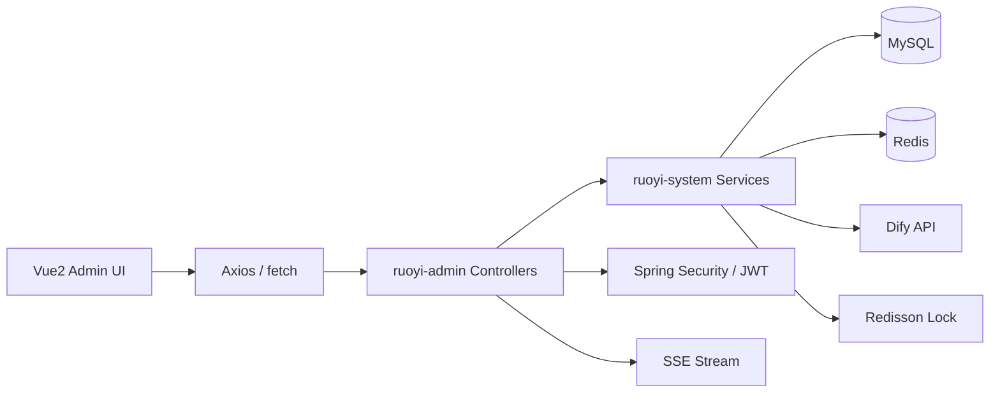

# Campus AI Assistant Admin

> 一个基于 **RuoYi + Spring Boot + Vue2 + Redis + Dify + SSE** 二次开发的校园智能问答与知识库管理平台


## 项目概览

这个项目不是一个单纯的大模型聊天 Demo，而是一个面向校园场景的 **AI 后台管理系统**。  
它基于若依后台框架构建，在保留若依成熟管理能力的基础上，新增了：

- AI 标准问答库管理
- 校园知识文档管理
- 知识库异步同步到 Dify Knowledge
- 大模型流式对话
- SSE 流式接口与前端打字机效果
- AI 接口限流保护
- 学生信息管理
- 教务工具接口预留（便于 Function Calling / Agent 接入）

一句话概括：

> 这是一个把 **后台管理、知识库运营、流式对话、缓存治理、权限控制、限流保护** 融合在一起的 AI 应用型项目。

---

## 为什么这个项目有价值

校园问答有几个典型特点：

- 高频问题多：奖学金、成绩、选课、请假、毕业流程、校园卡余额
- 制度文档多：规章制度、通知、办事说明
- 答案需要可控：不能完全依赖模型自由发挥
- 成本需要控制：不能所有问题都直接调用大模型

所以这个项目的核心思路不是“把问题全丢给模型”，而是做了一层业务编排：

1. 标准、高频、确定性问题优先走问答库
2. 制度和长文档内容通过知识库增强
3. 成绩、余额等实时数据走工具接口
4. 大模型承担自然语言理解、整合输出和复杂问答

这个思路比纯聊天机器人更贴近真实业务系统，也更适合写进简历和在面试里展开。

---

## 核心亮点

### 1. 基于若依做 AI 二开，而不是重新造后台

项目直接复用了若依成熟的：

- 用户管理
- 角色权限
- 菜单权限
- 登录认证
- 日志审计
- 参数配置
- 系统监控

这样做的好处是：

- 后台基础设施稳定
- 可快速接入业务功能
- 更贴近企业项目开发方式

### 2. 标准问答库 + 缓存治理

AI 标准问答模块支持问题、答案、分类、关键词、热度、状态等管理。  
为提升性能和稳定性，服务层对热点问答做了：

- Redis 缓存
- 空值缓存，防缓存穿透
- Redisson 分布式锁，防缓存击穿
- 缓存失效后的自动重建
- 数据更新后的缓存清理

### 3. 知识文档异步同步到 Dify

新增知识文档后，不会阻塞用户请求，而是：

1. 文档元数据先入库
2. 同步状态改为“同步中”
3. 使用 `@Async + ThreadPoolTaskExecutor` 异步上传
4. 成功后改为“已同步”
5. 失败回滚到“未同步”并记录日志

这条链路体现了：

- 状态机设计
- 后台异步任务设计
- 第三方系统对接能力

### 4. SSE 流式对话

后端新增了基于 `SseEmitter` 的流式对话接口：

- 60 秒超时控制
- 异步线程推送文本片段
- 前端基于 `fetch + ReadableStream` 逐步解析
- 消息逐段拼接，呈现打字机效果

这让系统不只是“能回答”，而是具备了更像真实 AI 产品的交互体验。

### 5. AI 接口限流保护

针对大模型聊天接口，项目增加了统一限流机制：

- 基于 `@RateLimiter` 注解
- AOP 切面统一处理
- Redis + Lua 脚本原子执行
- 支持用户维度优先、IP 兜底
- 对 SSE 接口限制为 **每分钟最多 3 次**

这部分很适合在面试中讲“稳定性治理”和“成本控制”。

---

## 项目功能地图

### 通用后台能力

- 登录与认证
- 用户、角色、菜单、部门、岗位
- 配置管理
- 日志管理
- Swagger 接口文档
- Redis 监控
- 服务器监控

### 自定义业务能力

- AI 校园热点问答库
- 校园知识文档管理
- 知识库同步状态跟踪
- 学生信息管理
- 教务工具接口
- 大模型对话接口
- SSE 流式聊天页面

---

## 自定义模块说明

## 1. AI 热点问答库

后台可维护标准问答数据，字段包括：

- `question`
- `answer`
- `category`
- `keywords`
- `hitCount`
- `isHot`
- `cacheTtl`
- `status`

用途：

- 存储高频标准问答
- 降低大模型调用频次
- 提高响应速度
- 增强答案可控性

对应代码：

- `ruoyi-admin/src/main/java/com/ruoyi/web/controller/system/AiCommonQaController.java`
- `ruoyi-system/src/main/java/com/ruoyi/system/service/impl/AiCommonQaServiceImpl.java`
- `ruoyi-system/src/main/resources/mapper/system/AiCommonQaMapper.xml`

## 2. 校园知识文档

知识文档模块管理知识库文档元数据，例如：

- 文档名称
- 文件路径
- 同步状态
- 备注

同步状态设计：

- `0` - 未同步
- `1` - 同步中
- `2` - 已同步

对应代码：

- `ruoyi-admin/src/main/java/com/ruoyi/web/controller/system/KnowledgeDocController.java`
- `ruoyi-system/src/main/java/com/ruoyi/system/service/impl/KnowledgeDocServiceImpl.java`
- `ruoyi-system/src/main/resources/mapper/system/KnowledgeDocMapper.xml`

## 3. 学生管理

学生模块管理基础学生信息，字段包括：

- `studentId`
- `password`
- `studentName`
- `majorCode`

这部分一方面是基础业务管理能力，另一方面也为后续 AI 场景提供真实业务上下文。

对应代码：

- `ruoyi-admin/src/main/java/com/ruoyi/web/controller/system/StudentController.java`
- `ruoyi-system/src/main/java/com/ruoyi/system/service/impl/StudentServiceImpl.java`
- `ruoyi-system/src/main/resources/mapper/system/StudentMapper.xml`

## 4. 教务工具接口

项目中预留了给 Agent / Function Calling 使用的工具接口，例如：

- 成绩查询
- 校园卡余额查询

当前返回值以 mock 为主，但接口形态已经具备，后续可以替换为真实业务系统或数据库查询。

对应代码：

- `ruoyi-admin/src/main/java/com/ruoyi/web/controller/system/EduApiController.java`

## 5. AI 对话

当前项目存在两类 AI 对话能力：

### Dify 流式聊天接口

- 路径：`/system/ai/chat`
- 通过 `WebClient` 调用 Dify
- 接口内部已接入 Redis 缓存与自定义限流逻辑

### SSE 流式对话接口

- 路径：`/api/ai/chat/stream`
- 返回 `SseEmitter`
- 前端逐块渲染
- 支持注解限流

对应代码：

- `ruoyi-admin/src/main/java/com/ruoyi/web/controller/system/AiController.java`
- `ruoyi-admin/src/main/java/com/ruoyi/web/controller/system/SseChatController.java`
- `ruoyi-ui/src/views/ai/chat.vue`

---

## 系统架构



---

## 核心流程

## 1. 登录与鉴权流程

1. 前端提交用户名、密码、验证码
2. `SysLoginService` 校验验证码和登录前规则
3. `AuthenticationManager` 完成认证
4. `TokenService` 生成 JWT，并将 `LoginUser` 写入 Redis
5. 请求进入系统时由 `JwtAuthenticationTokenFilter` 恢复登录态
6. 接口权限由 `@PreAuthorize + PermissionService` 控制

对应关键代码：

- `ruoyi-framework/src/main/java/com/ruoyi/framework/config/SecurityConfig.java`
- `ruoyi-framework/src/main/java/com/ruoyi/framework/security/filter/JwtAuthenticationTokenFilter.java`
- `ruoyi-framework/src/main/java/com/ruoyi/framework/web/service/SysLoginService.java`
- `ruoyi-framework/src/main/java/com/ruoyi/framework/web/service/TokenService.java`

## 2. 标准问答缓存流程

1. 查询问答时先查 Redis
2. 命中则直接返回
3. miss 时获取 Redisson 锁
4. 拿到锁的线程查库并重建缓存
5. 如果数据库无数据，则写空值缓存防穿透
6. 更新数据后清理相关缓存

这条链路体现的能力：

- 缓存读写策略
- 空值缓存
- 分布式锁
- 并发保护

## 3. 知识文档同步流程

1. 管理员新增知识文档
2. 系统写入 `knowledge_doc`
3. 异步调用 `asyncUploadToDifyEngine(docId)`
4. 更新状态为“同步中”
5. 调用 Dify Knowledge 上传接口
6. 成功则状态为“已同步”，失败则回退并记日志

## 4. SSE 流式对话流程

1. 前端调用 `/api/ai/chat/stream`
2. `@RateLimiter` 先做限流校验
3. Controller 创建 `SseEmitter`
4. 异步线程每 100ms 推送一个词
5. 前端读取 `ReadableStream`
6. 逐段拼接到聊天气泡中，形成打字机效果

---

## 当前项目体现出的工程能力

- Spring Security + JWT 无状态认证
- Redis 登录态管理与续期
- Redis 缓存治理
- Redisson 分布式锁
- 基于 Redis + Lua 的接口限流
- SSE 流式输出
- 异步任务执行
- Swagger 接口文档
- 前后端分离后台系统开发

---

## 技术深度适合面试展开的点

如果你是面试官，这个项目比较适合往这些方向追问：

- 为什么要做标准问答库而不是全靠大模型
- Redis 缓存如何防穿透、防击穿
- Redisson 在缓存重建中的作用
- 异步任务为什么适合知识库同步
- SSE 为什么适合做流式对话
- EventSource 与 `fetch + ReadableStream` 的取舍
- 大模型接口为什么必须做限流
- Redis + Lua 在限流中的原子性保障
- 如何把工具接口接入到 Agent / Function Calling

---

## 本地启动

## 1. 环境要求

- JDK 17
- Maven 3.9+
- Node.js / npm
- MySQL 8.x
- Redis

## 2. 配置文件

主要配置文件：

- `ruoyi-admin/src/main/resources/application.yml`
- `ruoyi-admin/src/main/resources/application-druid.yml`

当前默认配置包含：

- MySQL：`localhost:3306/ry-vue`
- Redis：`192.168.88.147:6379`
- Dify：本地示例地址与 key

启动前请按你的环境调整。

## 3. 后端启动

```bash
mvn clean install
mvn -pl ruoyi-admin -am spring-boot:run
```

## 4. 前端启动

```bash
cd ruoyi-ui
npm install
npm run dev
```

---

## 目录结构

```text
RuoYi-Vue
├─ ruoyi-admin
│  └─ Controller、登录、AI 对话、SSE、教务接口
├─ ruoyi-framework
│  └─ Security、JWT、限流、线程池、Redis、异常处理
├─ ruoyi-system
│  └─ Service、Mapper、自定义业务实体
├─ ruoyi-common
│  └─ 常量、工具、注解、AjaxResult
├─ ruoyi-ui
│  └─ Vue2 后台页面
└─ sql
   └─ 初始化 SQL 与业务表结构
```

---

## 后续可扩展方向

- 把标准问答从精确匹配升级为关键词召回或向量检索
- 对接真实 Dify Knowledge 上传接口
- 将知识库同步改造成可重试任务
- 增加 AI 对话上下文记忆
- 接入更多教务工具接口
- 增加测试覆盖率与监控告警
- 引入用户画像和更强的个性化问答能力

---

## 适合写进简历的关键词

`RuoYi` `Spring Boot` `Spring Security` `JWT` `Redis` `Redisson` `MyBatis` `Dify` `RAG` `SSE` `AI Chat` `Campus`

---

## 仓库说明

这个 README 已经从默认若依模板说明改成了当前项目本身的介绍。  
如果你正在看这个仓库首页，希望它能让你快速判断这个项目的价值：

- 它有完整后台管理能力
- 它有 AI 问答应用场景
- 它有缓存、限流、异步、流式输出这些工程化能力
- 它适合作为 Java 后端 / 全栈 / AI 应用开发方向的项目展示
