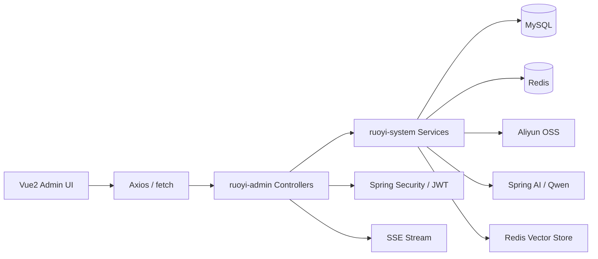

# Campus AI Assistant Admin

> 基于 **RuoYi + Spring AI + 通义千问 + Redis Vector Store + OSS + SSE** 构建的校园智能问答与知识库管理平台


---

## 项目简介

这是一个在若依后台框架基础上二次开发的 **校园 AI 问答平台**。  
它不是单纯的大模型聊天 Demo，而是一套完整的后台系统，覆盖了：

- 后台权限管理
- 标准问答库运营
- 知识文档管理
- OSS 文件上传
- 文档自动向量化入库
- RAG 检索增强
- Function Calling 工具调用
- SSE 流式对话
- 会话记忆
- Redis 限流保护

一句话概括：

> 这是一个把 **后台管理、知识库运营、向量检索、流式对话、工具调用、缓存治理、权限控制** 融合在一起的 AI 应用型项目。

---

## 当前版本已经完成的核心能力

### 1. 底层 AI 能力迁移到 Spring AI

项目已从早期的 Dify 直连对话模式迁移到：

- **Spring AI 1.0.0-M6**
- **阿里云通义千问 OpenAI Compatible Endpoint**

这样做的好处是：

- 模型调用统一抽象
- 更容易接入 Memory、RAG、Tool Calling
- 更方便后续替换模型供应商

### 2. RAG 知识库闭环

当前已经具备完整的 RAG 入库与检索链路：

1. 上传文件到阿里云 OSS
2. 从 OSS 读取文件流
3. 使用 `TikaDocumentReader` 解析 PDF / Word / TXT / HTML
4. 使用 `TokenTextSplitter` 做文本切片
5. 对切片做 overlap 处理
6. 写入 Redis Vector Store
7. 聊天时执行 `similaritySearch`
8. 将检索结果拼成 `System Prompt`
9. 再交给模型生成答案

### 3. Function Calling 工具调用

当前已经接入两类工具函数：

- `getStudentScore`
- `getCardBalance`

而且已经从“模拟逻辑”升级为**真实数据库查询**，不再只是写死返回值。

### 4. SSE 流式对话

项目支持基于 `SseEmitter` 的流式聊天接口：

- 后端持续推送
- 前端使用 `fetch + ReadableStream` 逐块解析
- 打字机效果输出
- 兼容 JSON 格式的 SSE 数据包

### 5. 会话记忆

项目已实现基于 Redis 的 `ChatMemory`：

- conversationId 作为会话主键
- 浏览器自动保存 conversationId
- 后端从 Redis 恢复会话上下文
- 支持断线重连和多轮续聊

### 6. 限流保护

针对 AI 对话接口，项目已实现：

- Redis + Lua 滑动窗口限流
- 注解式 `@RateLimiter`
- 支持用户维度优先、IP 兜底
- 防止大模型接口被恶意刷单

---

## 适用场景

- 校园智能问答后台
- 教务 / 学生服务 AI 助手
- 知识文档问答系统
- 基于若依的 AI 应用集成示例
- Java 后端 / 全栈 / AI 应用开发项目展示

---

## 技术栈

### 后端

- Spring Boot 3.3.3
- Spring Security
- JWT
- MyBatis
- PageHelper
- Druid
- Redis
- Redisson
- Spring AI 1.0.0-M6
- ChatClient
- ChatMemory
- Redis Vector Store
- TikaDocumentReader
- TokenTextSplitter
- SseEmitter
- `@Async + ThreadPoolTaskExecutor`
- Swagger / springdoc
- 阿里云 OSS SDK

### 前端

- Vue 2
- Vue Router 3
- Vuex
- Element UI
- Axios
- 原生 `fetch + ReadableStream`

### 外部组件

- MySQL
- Redis
- 阿里云 OSS
- 阿里云通义千问（DashScope Compatible Endpoint）

---

## 系统架构



---

## 项目结构

```text
RuoYi-Vue
├─ ruoyi-admin
│  ├─ Web 入口层
│  ├─ AI 对话接口
│  ├─ SSE 控制器
│  ├─ RAG 上传控制器
│  └─ Function Calling 配置
├─ ruoyi-framework
│  ├─ Security / JWT
│  ├─ Redis 配置
│  ├─ 限流切面
│  ├─ 线程池
│  └─ 全局异常处理
├─ ruoyi-system
│  ├─ 业务实体
│  ├─ Mapper / XML
│  ├─ OSS 服务
│  ├─ RAG 服务
│  └─ 教务统一查询服务
├─ ruoyi-common
│  ├─ 通用常量
│  ├─ AjaxResult
│  ├─ 工具类
│  └─ 注解
├─ ruoyi-ui
│  ├─ AI 聊天页
│  ├─ 知识文档页
│  └─ 后台管理页面
└─ sql
   └─ 初始化 SQL 与业务表
```

---

## 核心业务模块

## 1. AI 标准问答库

字段包括：

- `question`
- `answer`
- `category`
- `keywords`
- `hitCount`
- `isHot`
- `cacheTtl`
- `status`

用途：

- 沉淀高频标准问答
- 降低模型调用成本
- 提高响应速度
- 增强答案可控性

缓存策略：

- Redis 缓存
- 空值缓存防穿透
- Redisson 分布式锁防击穿
- 数据更新后主动清缓存

对应代码：

- `ruoyi-admin/src/main/java/com/ruoyi/web/controller/system/AiCommonQaController.java`
- `ruoyi-system/src/main/java/com/ruoyi/system/service/impl/AiCommonQaServiceImpl.java`

## 2. 校园知识文档

字段包括：

- `docId`
- `docName`
- `fileUrl`
- `status`
- `remark`

支持：

- 知识文档 CRUD
- OSS 上传
- 自动向量化入库
- 向量化状态跟踪

关键接口：

- `POST /system/knowledge/import-file`

对应代码：

- `ruoyi-admin/src/main/java/com/ruoyi/web/controller/system/KnowledgeDocController.java`
- `ruoyi-system/src/main/java/com/ruoyi/system/Oss/AliOssService.java`
- `ruoyi-system/src/main/java/com/ruoyi/system/service/RagService.java`

## 3. 学生管理

学生基础数据字段：

- `studentId`
- `password`
- `studentName`
- `majorCode`

该模块既是后台业务数据，又为 AI 工具调用与个性化问答提供上下文。

## 4. 成绩与一卡通查询

当前已经接入真实数据库查询，不再是纯 mock。

涉及表：

- `student`
- `student_score`
- `campus_card_account`

统一服务层：

- `IEduQueryService`
- `EduQueryServiceImpl`

统一复用位置：

- `EduApiController`
- `EduAiFunctionConfig`

## 5. AI 对话

当前存在两类 AI 对话能力：

### `/system/ai/chat`

- 基于 Spring AI 的流式对话接口
- 保留 Redis 缓存与 Lua 限流
- 通过 `QuestionAnswerAdvisor` 做 RAG

### `/api/ai/chat/stream`

- 基于 `SseEmitter`
- 支持：
  - 会话记忆
  - RAG 检索
  - Function Calling
  - `conversationId`
  - SSE 流式输出

前端默认优先调用：

- `/api/ai/chat/stream`

找不到时回退到：

- `/system/ai/chat`

---

## RAG 工作流

### 文档入库流程

1. 前端上传知识文档
2. 后端上传到阿里云 OSS
3. 根据 OSS URL 读取文件流
4. 使用 `TikaDocumentReader` 解析文本
5. 使用 `TokenTextSplitter` 做基础切片
6. 对切片追加 overlap
7. 写入 Redis Vector Store

### 问答检索流程

1. 用户提问
2. `VectorStore.similaritySearch(query)` 检索 Top-K 片段
3. 把召回片段拼装成 `System Prompt`
4. `ChatClient` 结合 Prompt、Memory、Functions 生成答案
5. 通过 SSE 流式返回前端

---

## Function Calling 工作流

当前注册的工具函数：

- `getStudentScore`
- `getCardBalance`

注册位置：

- `ruoyi-admin/src/main/java/com/ruoyi/web/config/EduAiFunctionConfig.java`

调用方式：

```java
chatClient.prompt(userPrompt)
    .functions("getStudentScore", "getCardBalance")
    .system(systemPrompt)
    .stream()
    .chatResponse();
```

特点：

- Function Bean 已接真实查库
- 和开放 API 走同一套服务逻辑
- 避免“一边 mock、一边真实”的分裂数据源

---

## 会话记忆设计

项目实现了 Redis 持久化 `ChatMemory`：

- `conversationId` 作为会话唯一标识
- 消息历史写入 Redis List
- 浏览器端自动持久化 `conversationId`
- 支持断线重连和多轮续聊

前端行为：

- 首次进入自动生成 `conversationId`
- 存入 `localStorage`
- 每次请求自动携带
- 点击“新会话”可手动切换上下文

---

## 限流机制

项目已从固定窗口升级为：

- **Redis ZSET 滑动窗口限流**

核心逻辑：

1. `ZREMRANGEBYSCORE` 清理窗口外旧请求
2. `ZCARD` 统计当前窗口请求数
3. `ZADD` 添加新请求
4. `PEXPIRE` 设置过期时间

优点：

- 高并发下原子执行
- 精度优于固定窗口
- 更适合 AI 类高成本接口

---

## 关键接口

### AI 对话

- `POST /system/ai/chat`
- `POST /api/ai/chat/stream`

### 知识文档

- `GET /system/knowledge/list`
- `POST /system/knowledge`
- `PUT /system/knowledge`
- `DELETE /system/knowledge/{docIds}`
- `POST /system/knowledge/import-file`

### 教务工具接口

- `GET /system/edu/api/score`
- `GET /system/edu/api/card/balance`

### RAG 导入

- `POST /system/rag/upload-and-import`

---

## 当前工程能力

- Spring Security + JWT 无状态认证
- Redis 登录态管理
- Redis + Lua 限流
- OSS 文件上传
- 文档自动向量化
- Redis Vector Store
- RAG 检索增强
- Function Calling
- SSE 流式输出
- Redis 持久化会话记忆
- 后台知识文档管理与导入

---

## 本地启动

## 1. 环境要求

- JDK 17
- Maven 3.9+
- Node.js / npm
- MySQL 8.x
- Redis

## 2. 配置文件

主要配置：

- `ruoyi-admin/src/main/resources/application.yml`
- `ruoyi-admin/src/main/resources/application-druid.yml`

重点配置项：

- `spring.ai.openai.*`
- `spring.ai.vectorstore.redis.*`
- `aliyun.oss.*`
- `spring.data.redis.*`

## 3. 后端启动

```bash
mvn clean install
mvn -pl ruoyi-admin -am spring-boot:run
```

## 4. 前端启动

```bash
cd ruoyi-ui
npm install
npm run dev
```

---

## 后续可扩展方向

- 批量上传多个知识文档并并行向量化
- 更完善的历史压缩 / 摘要记忆
- 知识文档标签过滤、来源分类、权限隔离
- 多租户知识库索引
- 独立 embedding 模型配置
- 检索命中可视化
- 导入进度、失败重试和后台任务中心

---

## 适合写进简历的关键词

`RuoYi` `Spring Boot` `Spring AI` `Tongyi Qianwen` `JWT` `Redis` `Redis Vector Store` `RAG` `Function Calling` `SSE` `OSS` `MyBatis` `Redisson`

---

## 仓库说明

这个 README 已经不再是若依默认模板说明，而是当前项目本身的完整介绍。  
如果你是面试官、招聘方或协作者，希望你通过这个仓库首页就能快速看明白：

- 这是一个真实的 AI 应用型后台项目
- 它具备完整的知识入库与检索增强链路
- 它不是纯聊天 Demo，而是后台、知识库、工具调用、会话记忆、流式输出的整合实践
