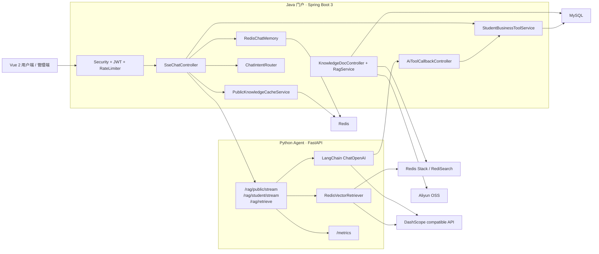
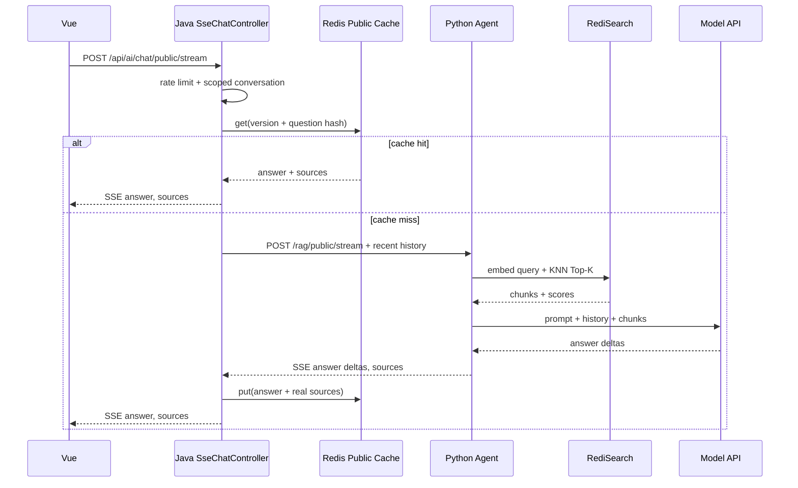
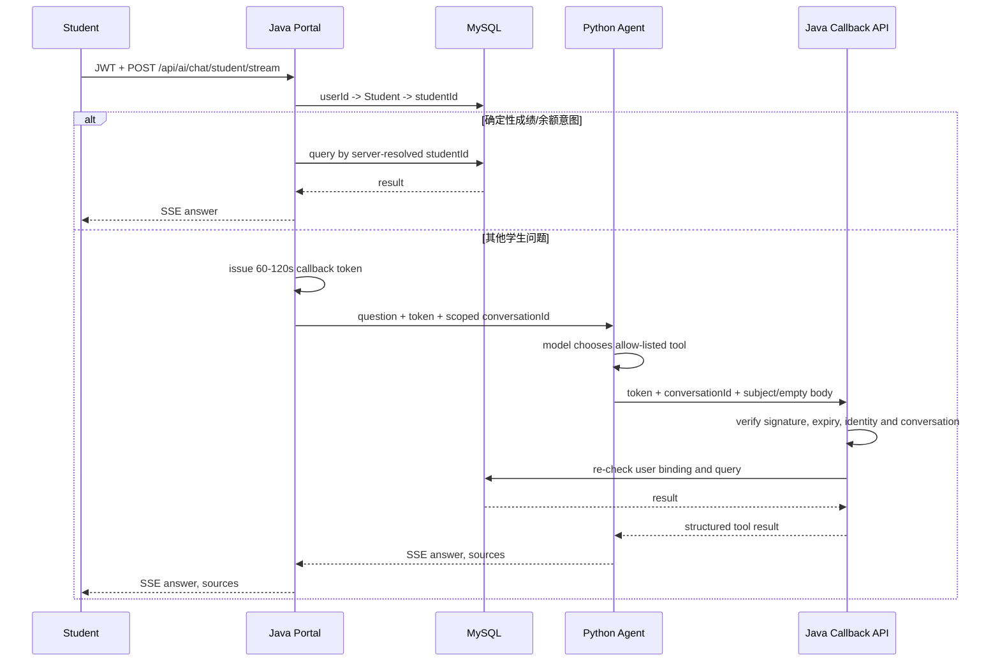
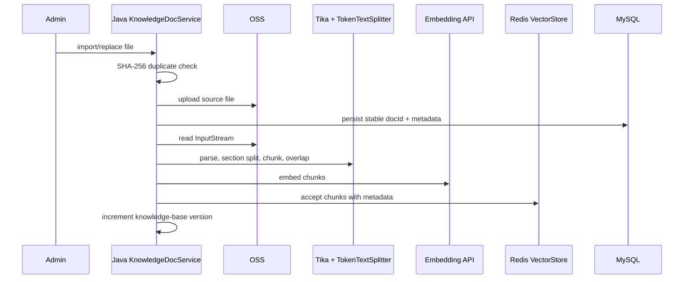

# 校园智能知识库问答平台架构

## 总体架构



边界约束：

- Java 是公网门户和身份可信边界，负责认证、授权、限流、会话 Scope、缓存及个人数据查询。
- Python 只负责检索、生成和白名单工具选择，不连接 MySQL。
- Spring AI 只存在于 Java 文档导入/维护管线：Tika、`TokenTextSplitter`、`EmbeddingModel`、Redis `VectorStore` 写入/删除。
- Python 服务失败时 Java 明确结束 SSE 并返回错误，不切回旧聊天实现。

## 公开问答时序



来源由检索结果转换，不由模型生成。Java 的 `campus.ai.chat.complete` 包含缓存和代理全程；Python 分别记录检索、模型流和首回答片段耗时。

## 学生频道与 callback 安全模型



成绩工具只允许 `subject`，余额工具没有参数。callback 请求体不是身份来源；Java 使用 token 中的 `userId/studentId` 与数据库绑定再次比对。公开入口不会签发 callback token。

## 文档导入与索引



Chunk metadata 包含 `docId`、`fileName`、`sourceUrl`、`documentType`、`section`、`chunkIndex`、`updatedAt`、`contentHash`。Python 首次检索时通过 `FT.INFO` 校验索引类型、前缀、字段、向量维度、算法和距离度量，不创建新索引也不静默降级。

## 会话与 SSE 生命周期

```text
ai:chat:memory:{public|student}:{user:{userId}|anonymous:{sessionId}}:{conversationId}
```

Java 读取最近 20 条、最多保存 100 条，TTL 7 天。自有 `ChatMessage` DTO 保持原有 Redis JSON `type/text` 格式兼容。SSE 超时、完成、异常、发送失败和客户端断开统一关闭生命周期，并取消 Reactor 订阅或异步 Future。

## 指标归属

| 指标 | Owner | 起止点 |
|---|---|---|
| `campus.ai.rag.retrieval` | Python | `retrieve()` 调用开始至 Embedding + RediSearch 完成/失败 |
| `campus.ai.llm.stream` | Python | 模型生成开始至迭代结束、异常或取消 |
| `campus.ai.chat.first-token` | Python | 模型生成开始至首个非空回答片段 |
| `campus.ai.chat.complete` | Java | 公开 HTTP/SSE 请求进入至缓存命中或 Python 流完整完成 |
| cache hit/miss | Java + Redis | 公开首轮缓存真实读取结果 |
| `campus.ai.llm.call` | Java | 学生频道 Python 工具型请求整体完成/失败 |
| `campus.ai.tool.query` | Java | 确定性成绩/余额查询 |

Python 指标从 `GET /metrics` 读取；Java Timer 从 Actuator `/actuator/metrics/{name}` 读取；缓存计数从管理员接口 `/system/ai/metrics/cache` 读取。

## 关键代码

- Java 聊天入口：`ruoyi-admin/src/main/java/com/ruoyi/web/controller/system/SseChatController.java`
- Python 客户端：`ruoyi-admin/src/main/java/com/ruoyi/web/service/PythonPublicRagClient.java`
- callback：`ruoyi-admin/src/main/java/com/ruoyi/web/controller/system/AiToolCallbackController.java`
- 学生查询：`ruoyi-system/src/main/java/com/ruoyi/system/service/StudentBusinessToolService.java`
- 文档管线：`ruoyi-system/src/main/java/com/ruoyi/system/service/RagService.java`
- Python API/指标：`ai-agent/app/main.py`、`ai-agent/app/service.py`、`ai-agent/app/metrics.py`
- Python 检索：`ai-agent/app/vector_store.py`
