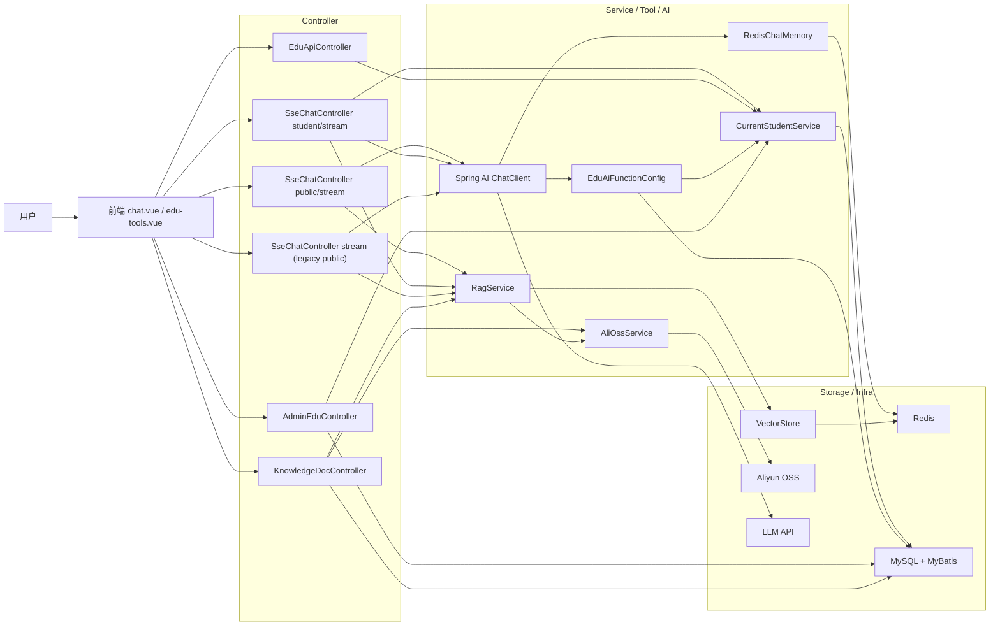
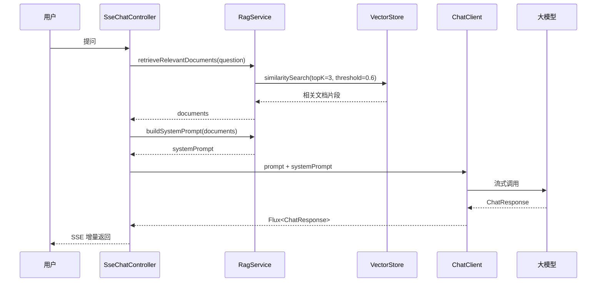
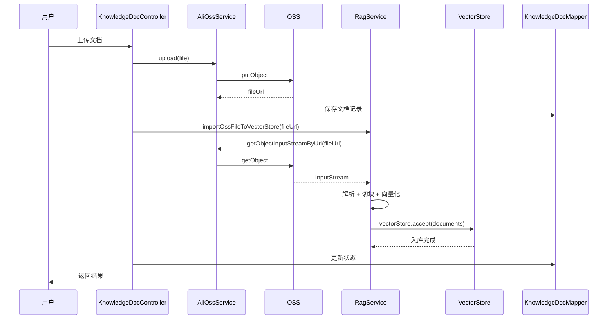
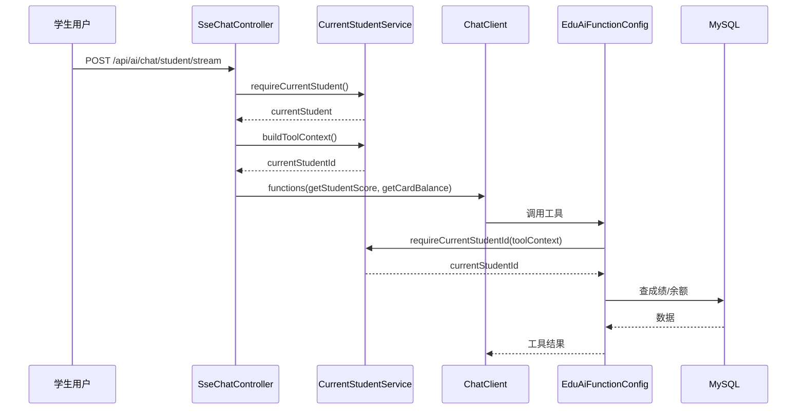
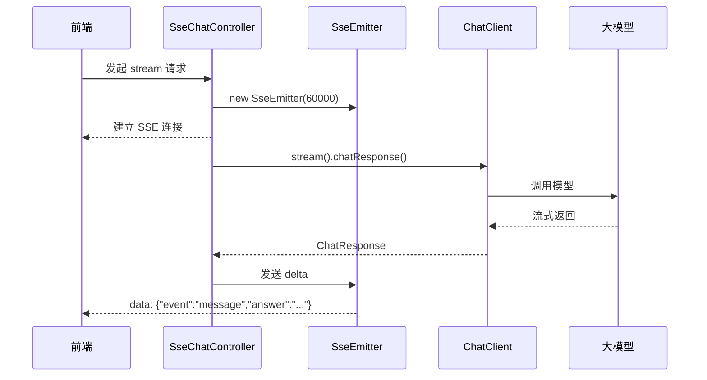
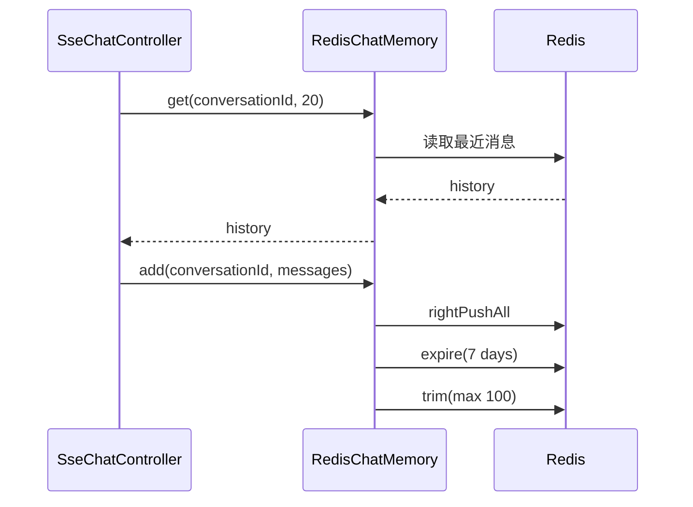
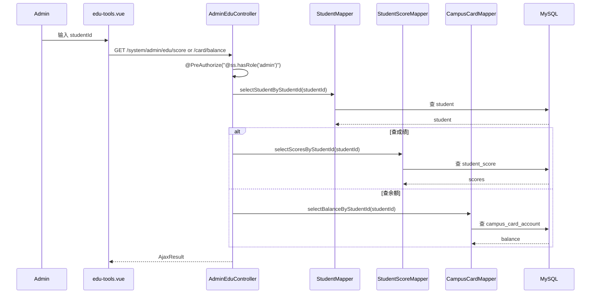

# 校园智能知识库助手架构与核心链路图

## 1. 系统总体架构图

代码路径：

- `ruoyi-admin/src/main/java/com/ruoyi/web/controller/system/SseChatController.java`
- `ruoyi-admin/src/main/java/com/ruoyi/web/controller/system/EduApiController.java`
- `ruoyi-admin/src/main/java/com/ruoyi/web/controller/system/AdminEduController.java`
- `ruoyi-admin/src/main/java/com/ruoyi/web/controller/system/KnowledgeDocController.java`
- `ruoyi-system/src/main/java/com/ruoyi/system/service/CurrentStudentService.java`
- `ruoyi-system/src/main/java/com/ruoyi/system/service/RagService.java`
- `ruoyi-admin/src/main/java/com/ruoyi/web/config/EduAiFunctionConfig.java`

## 2. RAG 问答时序图

代码路径：

- `ruoyi-admin/src/main/java/com/ruoyi/web/controller/system/SseChatController.java`
- `ruoyi-system/src/main/java/com/ruoyi/system/service/RagService.java`

证据不足说明：

- 当前仓库未发现“准确率 35% -> 88%”评测数据。

## 3. 文档上传入库时序图

代码路径：

- `ruoyi-admin/src/main/java/com/ruoyi/web/controller/system/KnowledgeDocController.java`
- `ruoyi-system/src/main/java/com/ruoyi/system/Oss/AliOssService.java`
- `ruoyi-system/src/main/java/com/ruoyi/system/service/RagService.java`

证据不足说明：

- 当前代码更接近固定 `CHUNK_SIZE=800` 与 `OVERLAP_CHARS=120`，不要讲成 `500-800 Token` 动态滑窗。

## 4. Function Calling 工具调用时序图

代码路径：

- `ruoyi-admin/src/main/java/com/ruoyi/web/controller/system/SseChatController.java`
- `ruoyi-admin/src/main/java/com/ruoyi/web/config/EduAiFunctionConfig.java`
- `ruoyi-system/src/main/java/com/ruoyi/system/service/CurrentStudentService.java`

说明：

- 学生工具已去身份入参。
- 工具不会信任模型传入的 `studentId`。

## 5. SSE 流式响应时序图

代码路径：

- `ruoyi-admin/src/main/java/com/ruoyi/web/controller/system/SseChatController.java`
- `ruoyi-ui/src/views/ai/chat.vue`

证据不足说明：

- 当前代码已实现 SSE 生命周期管理：每个请求统一持有 `SseEmitter`、`Flux` 订阅 `Disposable`、异步任务 `CompletableFuture`。
- 前端 `chat.vue` 已使用 `AbortController`，在页面离开、重复发送和“停止生成”时主动中止请求。
- `public / legacy chat` 断连、超时、异常时会统一 `close` 并尝试 `dispose` 上游 `Flux`。
- `student chat` 因为是“单次工具分发 + SSE 单条回推”，主要是 `cancel Future` 并阻止后续回推，不是逐 token 工具流。
- 这是资源释放优化，不改变学生 / 管理员权限边界，也不改变 `studentId` 绑定策略。
- 当前仓库未发现“首字响应 500ms”压测证据。

## 6. Redis ChatMemory 时序图

代码路径：

- `ruoyi-admin/src/main/java/com/ruoyi/web/service/RedisChatMemory.java`

证据不足说明：

- 当前真实实现是“最近 20 条读取 + 最多 100 条存储 + 7 天 TTL”，不是 `4096 Token` 窗口。

## 7. 管理员全量查询链路

代码路径：

- `ruoyi-admin/src/main/java/com/ruoyi/web/controller/system/AdminEduController.java`
- `ruoyi-system/src/main/java/com/ruoyi/system/mapper/StudentScoreMapper.java`
- `ruoyi-system/src/main/java/com/ruoyi/system/mapper/CampusCardMapper.java`
- `ruoyi-ui/src/views/ai/edu-tools.vue`
- `ruoyi-ui/src/api/system/edu.js`

说明：

- 这条链路是管理员独立后台接口。
- 不经过学生 Function Calling 工具链。

## 8. 面试现场 1 分钟画图版

### 8.1 总体图

`前端 -> Controller -> RAG / Tool / ChatMemory -> LLM / Redis / DB / OSS`

口头顺序：

1. 先讲聊天入口和文档入库入口。
2. 再讲公共 RAG、学生工具和 Redis 会话。
3. 最后补管理员独立查询接口。

### 8.2 权限边界图

`public chat -> 只做公共问答`

`student chat -> CurrentStudentService -> 学生工具 -> 只查自己`

`admin api -> admin role -> 按 studentId 查全量`

口头顺序：

1. 先讲为什么拆三条入口。
2. 再讲学生侧为什么不信任 `studentId`。
3. 最后讲管理员为什么必须走独立后台接口。
## 9. 知识库删除闭环

当前知识库删除链路已经补成“外部资源先删，数据库最后删”：

1. 后端根据 `docId` 查询 `knowledge_doc`
2. 从记录里的 `fileUrl` 提取文件定位信息
3. `RagService.deleteByFileUrl(fileUrl)` 按向量 metadata 删除对应 chunk
4. `AliOssService.deleteObjectByUrl(fileUrl)` 删除 OSS 源文件
5. 外部资源都成功后，再删除 `knowledge_doc` 数据库记录

这么做的原因是：

- 如果先删 DB，再删外部资源失败，就会失去定位信息
- OSS 和 Redis Vector Store 不在同一个本地事务里，不适合硬做分布式事务
- 当前更稳的策略是“尽力删除 + 明确日志 + DB 最后删除”
